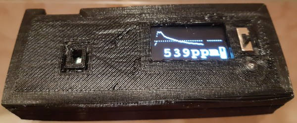
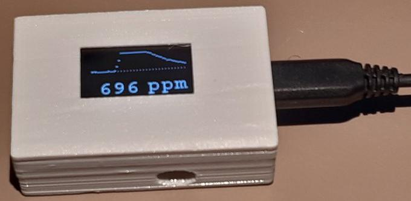

# covid-CO2 CO2 sensor

This project explains how to build a small, light and affordable DIY CO2 sensor useful to measure CO2 levels in indoor locations. CO2 can be used as a proxy to estimate the COVID-19 infection risk by aerosols, and thus to control ventilation (opening windows depending on CO2 levels, balancing cold and risk). Being portable it can be used to verify ventilation status in supermarkets or schools.

## Functionality 

The CO2 sensor has:
- an OLED display for CO2 measurement, and a graph for the past hour (default graph range is 400-1000ppm, dashed indicator line at 600ppm)
- optional LED with blinking pattern depending on CO2 level (thresholds at 600, 800, and 1000ppm)
- optional Li-ion battery with on/off switch and battery voltage indicator

It measures ca 20x35x55mm without battery, or ca 20x35x84mm with battery.

It is powered over micro-USB.

## Release history

- 4 January 2021: original release
- 6 January 2021, v1.0.1: bug fix, modified script to ensure LED remains off even if WiFi is not used or absent

## Project overview

There is a detailed illustrated building guide, and pre-built firmware images and 3D print files are provided. The only necessary software effort is to flash an initial Tasmota image to an ESP8266 board. There are different firmware versions depending on the CO2 sensor:
- Winsen MH-Z19B sensor with automatic baseline calibration off (manual calibration needed at least weekly!)
- Winsen MH-Z19B sensor with automatic baseline calibration on
- SenseAir S8 sensor
- Sensirion SCD30 sensor

There are different STL files to print a 3D-case (one bottom and one top file per case) for
- Winsen MH-Z19B version without battery
- Winsen MH-Z19B version with battery
- SenseAir S8 LP version without battery
- SenseAir S8 LP version with battery
- Sensirion SCD30 version without battery (will be uploaded later)
- Sensirion SCD30 version with battery (will be uploaded later)

The STL files can be viewed in a 3D viewer on https://www.thingiverse.com/thing:4712931/files

## Known issues

- For the battery version: the boost circuit does not have over-discharge protection, the design relies on the built-in circuitry of the battery (don't use it without). Some batteries may cycle up and down a few times when empty. When the battery is empty, the boost circuit may use a bit more current than the charge circuit can provide (because of the low battery voltage), so the ESP needs to be powered off until battery has some minimum charge.
- Tasmota script seems to hang approximately once/month (no OLED update, no MQTT update), unclear whether this is caused by sw or hw; sometimes reflashing is needed
- Sometimes the ESP board fails and needs to be replaced, perhaps this is an issue with low-quality boards, couldn't find the cause yet.
- Tasmota devices seem to drop i2c device functionality approximately once/year (OLED dark, MQTT/WiFi/sensor continue to work, i2c devices cannot be found), issue can be resolved by reflashing

## Wish list

- Horizontal display scrolling of graph using SSD1306 scroll command
- Data logging (data is not stored while WiFi is unavailable, for example during store visit)
- LED dimming (for now, can be done via Tasmota console using LedPwmMode \<dimfactor\>)
- OLED dimming to increase OLED lifetime (Tasmota command doesn't work on my OLED)
